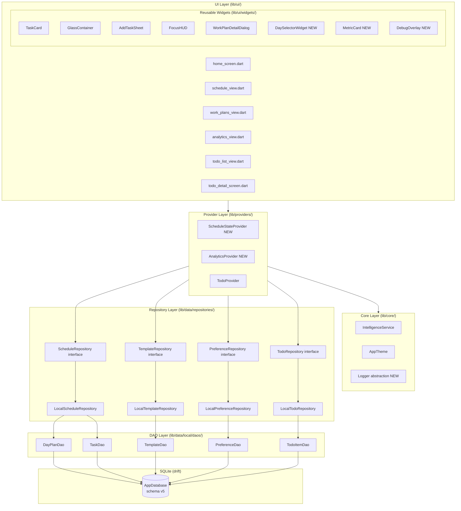

# Design Document — Chronos Planner Technical Specification Document

> **Single source of truth for engineering, QA, and DevOps.**
> App package: `chronosky` · Flutter SDK ≥ 3.0.0 · Schema v4 → v5

---

## Overview

Chronos Planner (`chronosky`) is a desktop-first Flutter productivity application. See Section 1 (Executive Summary) for the full architectural overview.

## Architecture

See Section 3 (Architecture Diagram) and Section 4 (Module Breakdown) for the complete layered architecture, dependency flow, and module specifications.

## Components and Interfaces

See Section 6 (API Contract) for repository interface contracts, Section 8 (UI Component Library) for widget APIs, and Section 4 (Module Breakdown) for component responsibilities.

## Data Models

See Section 5 (Data Model Specifications) for complete field-by-field specifications of all domain models and DTOs.

---

## 1. Executive Summary

Chronos Planner (`chronosky`) is a desktop-first Flutter productivity application built on a strict four-layer architecture (UI → Providers → Repositories → DAOs) with `provider` ^6.1.1 (`ChangeNotifier`) as the sole state-management library and `drift` ^2.25.0 as the SQLite ORM. The primary risk areas are: (1) the `ScheduleProvider` monolith exceeding 400 lines and requiring a split into `ScheduleStateProvider` + `AnalyticsProvider`; (2) the schema v4→v5 migration introducing a `TemplateActiveDays` junction table and CASCADE foreign keys, which must be wrapped in a single Drift transaction to prevent data corruption; and (3) the absence of a `Result<T>` error-handling contract in repository interfaces, which currently allows silent failures to corrupt optimistic UI state. All three risks have concrete mitigations specified in this document.

---

## 2. Technology Stack

| Package | Version Constraint | Purpose | Justification |
|---|---|---|---|
| `flutter` SDK | ≥ 3.0.0 | UI framework | Cross-platform desktop + mobile |
| `provider` | ^6.1.1 | State management (`ChangeNotifier`) | Mandated by Req 1.5; no BLoC/Riverpod in v1.x |
| `drift` | ^2.31.0 | SQLite ORM with reactive streams | Upgrade from ^2.25.0; latest stable patch in ^2.x range (Req 16.4) |
| `drift_dev` | ^2.31.0 | Code generation for Drift | Must match `drift` version |
| `sqlite3_flutter_libs` | ^0.5.0 | Native SQLite binaries | Must be verified compatible after every `drift` upgrade (Req 16.11) |
| `path_provider` | ^2.1.0 | Platform documents directory | Required for DB file path (Req 4.7) |
| `path` | ^1.9.0 | Path joining utilities | Used in `_openConnection()` |
| `uuid` | ^4.3.3 | UUID v4 generation | All entity IDs |
| `intl` | ^0.20.2 | Date/time/currency formatting + i18n | Req 13.4, 13.5, 13.6 |
| `google_fonts` | ^8.0.1 | Inter typeface | Req 2.16 |
| `window_manager` | ^0.5.1 | Desktop window resize/reposition | Focus Mode (Req 11.1) |
| `flutter_localizations` | SDK | Material/Cupertino i18n delegates | Req 13.1 (new — add to pubspec) |
| `cupertino_icons` | ^1.0.8 | iOS-style icons | Existing |
| `build_runner` | ^2.4.0 | Code generation runner | Drift + l10n |
| `flutter_lints` | ^6.0.0 | Lint rule set | Req 6.2 |
| `flutter_launcher_icons` | ^0.14.3 | App icon generation | Existing |
| `file_picker` | ^8.0.0 | File selection (retain if feature implemented) | Req 6.12 — retain until confirmed unused |
| `just_audio` | ^0.9.40 | Audio playback (retain if feature implemented) | Req 6.12 — retain until confirmed unused |
| `mocktail` | ^1.0.0 | Mock generation for tests | Req 7.17 (new — add to dev_dependencies) |

**Packages to remove (tracked as tech-debt tickets):**
- `shared_preferences` ^2.2.2 — remove after confirming migration flag set in all production installs (Req 16.2)

---

## 3. Architecture Diagram



**Dependency rule:** Arrows flow downward only. No lower layer imports from a higher layer (Req 1.1).

---

## 4. Module Breakdown

### 4.1 Schedule Module

**Screens:** `lib/ui/screens/schedule_view.dart`

**Providers:**
- `lib/providers/schedule_state_provider.dart` (split from `ScheduleProvider` when > 400 lines) — owns `_weekPlan`, `_selectedDayIndex`, `_undoStack`, `_sortOrder`, and all CRUD + undo methods
- `lib/providers/analytics_provider.dart` (split from `ScheduleProvider`) — owns computed metrics: `efficiency`, `totalFocusHours`, `categoryDistribution`, `totalTasks`, `completedTasks`

**Repositories:** `ScheduleRepository` (interface) → `LocalScheduleRepository`

**DAOs:** `DayPlanDao`, `TaskDao`

**Models:** `Task`, `DayPlan`

**Widgets:** `DaySelectorWidget` (extracted from `ScheduleView`), `TaskCard`, `AddTaskSheet`

**Key behaviours:**
- Rolling 7-day window starting from today; missing days auto-created on load
- Optimistic UI updates with rollback on repository failure (Req 3A.2)
- Undo stack capped at 50 entries with FIFO eviction (Req 8.10)
- Sort order persisted via `PreferenceRepository` under key `sort_order`
- `Selector<ScheduleStateProvider, List<Task>>` used in `TaskCard` list to prevent analytics section rebuilds (Req 8.2)

### 4.2 Templates Module

**Screens:** `lib/ui/screens/work_plans_view.dart`

**Providers:** `ScheduleStateProvider` (template CRUD methods)

**Repositories:** `TemplateRepository` (interface) → `LocalTemplateRepository`

**DAOs:** `TemplateDao`

**Models:** `PlanTemplate`, `TemplateTask`

**Widgets:** `WorkPlanDetailDialog`, `AddTaskSheet`

**Key behaviours:**
- N+1 query fixed: `getAllTemplates()` uses a single JOIN or batched `WHERE templateId IN (...)` (Req 3C.18)
- `activeDays` migrated from comma-separated string to `TemplateActiveDays` junction table in schema v5 (Req 4.3)
- Recurring auto-apply on `_loadData()` checks `sourceTemplateId` to prevent duplicates

### 4.3 Analytics Module

**Screens:** `lib/ui/screens/analytics_view.dart`

**Providers:** `AnalyticsProvider` (read-only computed values from `ScheduleStateProvider._weekPlan`)

**Services:** `IntelligenceService` (stateless)

**Widgets:** `MetricCard` (extracted; accepts only primitive data — no provider access), `RepaintBoundary` around `_DonutChartPainter` and energy-peaks bar chart (Req 8.11)

**Key behaviours:**
- `getEnergyPeaks()` offloaded to `compute()` when task history > 500 items (Req 8.9)
- `AnalyticsProvider` uses `Selector<ScheduleStateProvider, List<DayPlan>>` to rebuild only when `_weekPlan` changes

### 4.4 Todo Module

**Screens:** `lib/ui/screens/todo_list_view.dart`, `lib/ui/screens/todo_detail_screen.dart`

**Providers:** `TodoProvider`

**Repositories:** `TodoRepository` (interface) → `LocalTodoRepository`

**DAOs:** `TodoItemDao`

**Models:** `TodoItem`

**Key behaviours:**
- Reactive stream via `watchTodos()` drives UI updates without `notifyListeners()` on every write
- `StreamSubscription` cancelled in `dispose()` (Req 8.7)
- Title validation: 1–200 characters (Req 3D.21)

### 4.5 Focus Mode Module

**Screens:** `lib/ui/screens/home_screen.dart` (toggle logic)

**Widgets:** `FocusHUD`

**Platform:** `window_manager` ^0.5.1 (desktop only)

**Key behaviours:**
- Enter: `setAlwaysOnTop(true)` → `setSize(320×200)` → `setAlignment(topRight)` (Req 11.2)
- Exit: `setAlwaysOnTop(false)` → `setSize(1200×800)` → `center()` (Req 11.3)
- All calls guarded with `Platform.isWindows || Platform.isMacOS || Platform.isLinux` (Req 11.4)
- `WindowListener.onWindowClose` calls `ScheduleStateProvider.dispose()` to flush pending state (Req 11.9)
- `MissingPluginException` caught and logged; Focus Mode button disabled on unsupported platforms (Req 11.7)

### 4.6 Core Module

**Services:**
- `lib/core/services/intelligence_service.dart` — stateless analytics; refactored to use `RecommendationStrategy` interface (Req 6.5)
- `lib/core/services/logger.dart` (new) — `Logger` abstract class with `ConsoleLogger` / `NoOpLogger` / `CrashReportingLogger` implementations (Req 14.1–14.3)

**Theme:** `lib/core/theme/app_theme.dart` — `AppColors`, `AppTextStyles`, `AppSpacing`, `AppRadius`, `AppShadows`, `AppAnimDurations`, `AppGradients`

**i18n:** `lib/l10n/app_en.arb` (new) — all user-visible strings; `AppLocalizations` generated via `flutter gen-l10n` (Req 13.2–13.3)

---

## 5. Data Model Specifications

### 5.1 Task

```dart
@immutable
class Task {
  final String id;           // UUID v4; non-empty
  final String title;        // 1–200 chars; assert(title.isNotEmpty && title.length <= 200)
  final String startTime;    // "HH:mm" format; validated before persist
  final String endTime;      // "HH:mm" format; not equal to startTime
  final TaskType type;       // enum: work | personal | health | leisure
  final TaskPriority priority;      // enum: low | medium | high; default medium
  final TaskEnergyLevel energyLevel; // enum: low | medium | high; default medium
  final double estimatedCost; // >= 0.0, finite; default 0.0
  final double actualCost;    // >= 0.0, finite; default 0.0 (user-editable TBD — C2)
  final String description;   // optional; default ''
  final String sourceTemplateId; // '' if not from template; UUID v4 if applied from template
  final bool completed;       // default false
}
```

**Validation rules (enforced at model layer via `assert` + at UI layer):**
- `title`: 1–200 chars
- `startTime` / `endTime`: regex `^([01]\d|2[0-3]):[0-5]\d$`; not equal
- `estimatedCost` / `actualCost`: `>= 0.0`, `isFinite`, not `isNaN`

**Enum storage:** stored as `.name` string in SQLite; deserialized with `firstWhere((e) => e.name == raw, orElse: () => defaultValue)` (Req 4.2)

### 5.2 DayPlan

```dart
@immutable
class DayPlan {
  final String id;          // UUID v4
  final DateTime date;      // stored as Drift dateTime(); midnight-normalized
  final String weekKey;     // derived: "YYYY-W##" (ISO week); NOT stored — derived at read time
  // Derived at read time (NOT stored in DB — Req 4.12):
  String get dateStr   => DateFormat('MMM d').format(date);   // e.g. "Feb 10"
  String get dayOfWeek => DateFormat('EEEE').format(date);    // e.g. "Monday"
  final List<Task> tasks;   // unmodifiable view (Req 6.9)
}
```

**Note:** `dateStr` and `dayOfWeek` are computed getters, not stored columns. `tasks` is exposed as `List.unmodifiable(tasks)`.

### 5.3 PlanTemplate

```dart
@immutable
class PlanTemplate {
  final String id;          // UUID v4
  final String name;        // 1–100 chars; assert(name.isNotEmpty && name.length <= 100)
  final String description; // optional; default ''
  final List<Task> tasks;   // template tasks; unmodifiable view
  final List<int> activeDays; // 0=Mon … 6=Sun; stored in TemplateActiveDays junction table (v5)
  bool get isRecurring => activeDays.isNotEmpty;
}
```

### 5.4 TemplateTask

`TemplateTask` is a Drift-generated row type from the `TemplateTasks` table. It maps 1:1 to a `Task` domain object when loaded, with `sourceTemplateId` set to the parent template's `id`. Fields mirror `Task` except no `dayPlanId` and no `completed` column.

### 5.5 TodoItem

```dart
@immutable
class TodoItem {
  final String id;           // UUID v4
  final String title;        // 1–200 chars
  final String description;  // optional; default ''
  final bool completed;      // default false
  final DateTime createdAt;  // set at insert time; not user-editable
}
```

### 5.6 TaskDto / TodoItemDto (v1.1 export/import)

```dart
class TaskDto {
  final int schemaVersion;   // current: 1
  final String id;
  final String title;
  final String startTime;
  final String endTime;
  final String type;         // enum name string
  final String priority;
  final String energyLevel;
  final double estimatedCost;
  final double actualCost;
  final String description;
  final String sourceTemplateId;
  final bool completed;
}

class TodoItemDto {
  final int schemaVersion;   // current: 1
  final String id;
  final String title;
  final String description;
  final bool completed;
  final String createdAt;    // ISO 8601 string
}
```

Both DTOs are separate from domain models (Req 4.10). Conversion: `TaskDto.fromDomain(Task)` / `Task.fromDto(TaskDto)`.

### 5.7 Result\<T\> Sealed Class

```dart
sealed class Result<T> {
  const Result();
}

final class Success<T> extends Result<T> {
  final T value;
  const Success(this.value);
}

final class Failure<T> extends Result<T> {
  final AppFailure failure;
  const Failure(this.failure);
}
```

### 5.8 Failure Sealed Class Hierarchy

```dart
sealed class AppFailure {
  final String message;
  final Object? exception;
  final StackTrace? stackTrace;
  const AppFailure(this.message, {this.exception, this.stackTrace});
}

final class DatabaseFailure extends AppFailure {
  const DatabaseFailure(super.message, {super.exception, super.stackTrace});
}

final class ValidationFailure extends AppFailure {
  const ValidationFailure(super.message);
}

final class NetworkFailure extends AppFailure {
  const NetworkFailure(super.message, {super.exception, super.stackTrace});
}

final class UnknownFailure extends AppFailure {
  const UnknownFailure(super.message, {super.exception, super.stackTrace});
}
```

All repository methods return `Future<Result<T>>` (Req 10.2). Providers pattern-match on `Success`/`Failure` and surface errors via `errorMessage` field + `SnackBar`.

---

## 6. API Contract

Since Chronos Planner is a local-only app (no remote API in v1.x), this section documents repository interface contracts and a v1.3 cloud-sync placeholder.

### 6.1 ScheduleRepository

```dart
abstract class ScheduleRepository {
  /// Returns exactly [count] DayPlan objects starting from today.
  /// Creates missing rows in the database if necessary.
  /// Returns: Success(List<DayPlan>) | Failure(DatabaseFailure)
  Future<Result<List<DayPlan>>> getUpcomingDays(int count);

  /// Adds [task] to the day matching [date], auto-creating the DayPlan if needed.
  /// Returns: Success(void) | Failure(DatabaseFailure | ValidationFailure)
  Future<Result<void>> addTaskToDate(DateTime date, Task task);

  /// Adds [task] to an existing DayPlan identified by [dayPlanId].
  /// Returns: Success(void) | Failure(DatabaseFailure)
  Future<Result<void>> addTask(String dayPlanId, Task task);

  /// Updates the task identified by [taskId] within [dayPlanId].
  /// Returns: Success(void) | Failure(DatabaseFailure | ValidationFailure)
  Future<Result<void>> updateTask(String dayPlanId, String taskId, Task task);

  /// Deletes the task identified by [taskId] from [dayPlanId].
  /// Returns: Success(void) | Failure(DatabaseFailure)
  Future<Result<void>> deleteTask(String dayPlanId, String taskId);

  /// Replaces all tasks for [dayPlan] in a single Drift transaction.
  /// Returns: Success(void) | Failure(DatabaseFailure)
  Future<Result<void>> saveDayPlan(DayPlan dayPlan);

  /// Deletes all tasks for the DayPlan identified by [dayPlanId].
  /// Returns: Success(void) | Failure(DatabaseFailure)
  Future<Result<void>> clearDay(String dayPlanId);
}
```

### 6.2 TemplateRepository

```dart
abstract class TemplateRepository {
  /// Returns all templates with their tasks in a single JOIN query.
  /// Returns: Success(List<PlanTemplate>) | Failure(DatabaseFailure)
  Future<Result<List<PlanTemplate>>> getAllTemplates();

  /// Returns templates where activeDays is non-empty.
  /// Returns: Success(List<PlanTemplate>) | Failure(DatabaseFailure)
  Future<Result<List<PlanTemplate>>> getRecurringTemplates();

  /// Persists a new template and its tasks.
  /// Returns: Success(void) | Failure(DatabaseFailure | ValidationFailure)
  Future<Result<void>> addTemplate(PlanTemplate template);

  /// Updates template name and description only.
  /// Returns: Success(void) | Failure(DatabaseFailure | ValidationFailure)
  Future<Result<void>> updateTemplate(String id, {required String name, required String description});

  /// Deletes template and all associated TemplateTasks in a single transaction.
  /// Returns: Success(void) | Failure(DatabaseFailure)
  Future<Result<void>> deleteTemplate(String id);

  /// Adds a task to an existing template.
  /// Returns: Success(void) | Failure(DatabaseFailure)
  Future<Result<void>> addTaskToTemplate(String templateId, Task task);

  /// Updates a task within a template.
  /// Returns: Success(void) | Failure(DatabaseFailure)
  Future<Result<void>> updateTaskInTemplate(String templateId, String taskId, Task task);

  /// Removes a task from a template.
  /// Returns: Success(void) | Failure(DatabaseFailure)
  Future<Result<void>> removeTaskFromTemplate(String templateId, String taskId);

  /// Replaces the activeDays for a template (writes to TemplateActiveDays junction table).
  /// Returns: Success(void) | Failure(DatabaseFailure)
  Future<Result<void>> updateTemplateActiveDays(String templateId, List<int> days);
}
```

### 6.3 TodoRepository

```dart
abstract class TodoRepository {
  /// Returns all todos ordered by createdAt descending.
  /// Returns: Success(List<TodoItem>) | Failure(DatabaseFailure)
  Future<Result<List<TodoItem>>> loadTodos();

  /// Reactive stream; emits on every change to the todos table.
  Stream<List<TodoItem>> watchTodos();

  /// Creates a new TodoItem with a generated UUID.
  /// Returns: Success(TodoItem) | Failure(DatabaseFailure | ValidationFailure)
  Future<Result<TodoItem>> addTodo(String title, {String description = ''});

  /// Replaces the TodoItem row.
  /// Returns: Success(void) | Failure(DatabaseFailure | ValidationFailure)
  Future<Result<void>> updateTodo(TodoItem todo);

  /// Deletes the TodoItem by id.
  /// Returns: Success(void) | Failure(DatabaseFailure)
  Future<Result<void>> deleteTodo(String id);
}
```

### 6.4 PreferenceRepository

```dart
abstract class PreferenceRepository {
  Future<String?> get(String key);
  Future<void> set(String key, String value);
  Future<void> remove(String key);
}
// Note: getAll() moved to BulkPreferenceRepository per ISP (Req 6.7)

abstract class BulkPreferenceRepository extends PreferenceRepository {
  Future<Map<String, String>> getAll();
}
```

### 6.5 Cloud Sync API Placeholder (v1.3 Roadmap)

```yaml
# OpenAPI 3.1 skeleton — not implemented in v1.x
openapi: "3.1.0"
info:
  title: Chronos Planner Sync API
  version: "1.0.0"
paths:
  /v1/sync/tasks:
    post:
      summary: Upload local task delta
      requestBody:
        content:
          application/json:
            schema:
              $ref: '#/components/schemas/TaskSyncRequest'
      responses:
        '200':
          description: Sync accepted
        '409':
          description: Conflict — server version newer
  /v1/sync/pull:
    get:
      summary: Pull remote changes since lastSyncAt
      parameters:
        - name: since
          in: query
          schema:
            type: string
            format: date-time
components:
  schemas:
    TaskSyncRequest:
      type: object
      required: [schemaVersion, tasks, deviceId, lastSyncAt]
      properties:
        schemaVersion: { type: integer, example: 1 }
        deviceId: { type: string, format: uuid }
        lastSyncAt: { type: string, format: date-time }
        tasks:
          type: array
          items: { $ref: '#/components/schemas/TaskDto' }
```

All network requests MUST use HTTPS (TLS 1.2+) and validate the server certificate chain (Req 9.3).

---

## 7. Database Schema

### 7.1 Target Schema — Version 5

#### Table: `day_plans`

| Column | Drift Type | SQLite Type | Constraints |
|---|---|---|---|
| `id` | `TextColumn` | TEXT | PRIMARY KEY |
| `date` | `DateTimeColumn` | INTEGER (Unix ms) | NOT NULL |
| `week_key` | `TextColumn` | TEXT | NOT NULL; format `YYYY-W##` |

**Removed in v5:** `date_str`, `day_of_week` — derived at read time via `intl` (Req 4.12).

**Index:** `CREATE INDEX idx_day_plans_date ON day_plans(date);`
**Index:** `CREATE INDEX idx_day_plans_week_key ON day_plans(week_key);`

#### Table: `tasks`

| Column | Drift Type | SQLite Type | Constraints |
|---|---|---|---|
| `id` | `TextColumn` | TEXT | PRIMARY KEY |
| `day_plan_id` | `TextColumn` | TEXT | NOT NULL; FK → `day_plans(id)` ON DELETE CASCADE |
| `title` | `TextColumn` | TEXT | NOT NULL; CHECK(length(title) BETWEEN 1 AND 200) |
| `description` | `TextColumn` | TEXT | NOT NULL DEFAULT '' |
| `start_time` | `TextColumn` | TEXT | NOT NULL |
| `end_time` | `TextColumn` | TEXT | NOT NULL |
| `type` | `TextColumn` | TEXT | NOT NULL DEFAULT 'work' |
| `priority` | `TextColumn` | TEXT | NOT NULL DEFAULT 'medium' |
| `energy_level` | `TextColumn` | TEXT | NOT NULL DEFAULT 'medium' |
| `estimated_cost` | `RealColumn` | REAL | NOT NULL DEFAULT 0.0 |
| `actual_cost` | `RealColumn` | REAL | NOT NULL DEFAULT 0.0 |
| `completed` | `BoolColumn` | INTEGER | NOT NULL DEFAULT 0 |
| `source_template_id` | `TextColumn` | TEXT | NOT NULL DEFAULT '' |

**Index:** `CREATE INDEX idx_tasks_day_plan_id ON tasks(day_plan_id);`
**Index:** `CREATE INDEX idx_tasks_source_template_id ON tasks(source_template_id) WHERE source_template_id != '';`

#### Table: `plan_templates`

| Column | Drift Type | SQLite Type | Constraints |
|---|---|---|---|
| `id` | `TextColumn` | TEXT | PRIMARY KEY |
| `name` | `TextColumn` | TEXT | NOT NULL; CHECK(length(name) BETWEEN 1 AND 100) |
| `description` | `TextColumn` | TEXT | NOT NULL DEFAULT '' |

**Removed in v5:** `active_days` TEXT column — replaced by `template_active_days` junction table.

#### Table: `template_tasks`

| Column | Drift Type | SQLite Type | Constraints |
|---|---|---|---|
| `id` | `TextColumn` | TEXT | PRIMARY KEY |
| `template_id` | `TextColumn` | TEXT | NOT NULL; FK → `plan_templates(id)` ON DELETE CASCADE |
| `title` | `TextColumn` | TEXT | NOT NULL; CHECK(length(title) BETWEEN 1 AND 200) |
| `description` | `TextColumn` | TEXT | NOT NULL DEFAULT '' |
| `start_time` | `TextColumn` | TEXT | NOT NULL |
| `end_time` | `TextColumn` | TEXT | NOT NULL |
| `type` | `TextColumn` | TEXT | NOT NULL DEFAULT 'work' |
| `priority` | `TextColumn` | TEXT | NOT NULL DEFAULT 'medium' |
| `energy_level` | `TextColumn` | TEXT | NOT NULL DEFAULT 'medium' |
| `estimated_cost` | `RealColumn` | REAL | NOT NULL DEFAULT 0.0 |

**Index:** `CREATE INDEX idx_template_tasks_template_id ON template_tasks(template_id);`

#### Table: `template_active_days` (NEW in v5)

| Column | Drift Type | SQLite Type | Constraints |
|---|---|---|---|
| `template_id` | `TextColumn` | TEXT | NOT NULL; FK → `plan_templates(id)` ON DELETE CASCADE |
| `day_index` | `IntColumn` | INTEGER | NOT NULL; CHECK(day_index BETWEEN 0 AND 6) |

**Primary Key:** `(template_id, day_index)` — composite PK prevents duplicates.

#### Table: `preferences`

| Column | Drift Type | SQLite Type | Constraints |
|---|---|---|---|
| `key` | `TextColumn` | TEXT | PRIMARY KEY |
| `value` | `TextColumn` | TEXT | NOT NULL |

#### Table: `todo_items`

| Column | Drift Type | SQLite Type | Constraints |
|---|---|---|---|
| `id` | `TextColumn` | TEXT | PRIMARY KEY |
| `title` | `TextColumn` | TEXT | NOT NULL; CHECK(length(title) BETWEEN 1 AND 200) |
| `description` | `TextColumn` | TEXT | NOT NULL DEFAULT '' |
| `completed` | `BoolColumn` | INTEGER | NOT NULL DEFAULT 0 |
| `created_at` | `DateTimeColumn` | INTEGER | NOT NULL |

**Index:** `CREATE INDEX idx_todo_items_created_at ON todo_items(created_at DESC);`

### 7.2 Migration Plan

```dart
// In AppDatabase.migration:
MigrationStrategy(
  onCreate: (m) async {
    await m.createAll();
    await customStatement('PRAGMA foreign_keys = ON;');
  },
  onUpgrade: (m, from, to) async {
    await customStatement('PRAGMA foreign_keys = OFF;');
    if (from < 2) {
      // v1 → v2: add source_template_id and active_days
      await m.addColumn(tasks, tasks.sourceTemplateId);
      await m.addColumn(planTemplates, planTemplates.activeDays); // temp column
    }
    if (from < 3) {
      // v2 → v3: create todo_items table
      await m.createTable(todoItems);
    }
    if (from < 4) {
      // v3 → v4: add energy/cost columns
      await m.addColumn(tasks, tasks.energyLevel);
      await m.addColumn(tasks, tasks.estimatedCost);
      await m.addColumn(tasks, tasks.actualCost);
      await m.addColumn(templateTasks, templateTasks.energyLevel);
      await m.addColumn(templateTasks, templateTasks.estimatedCost);
    }
    if (from < 5) {
      // v4 → v5: junction table + CASCADE FKs + remove derived columns
      // Step 1: Create new junction table
      await m.createTable(templateActiveDays);
      // Step 2: Migrate existing comma-separated activeDays to junction rows
      final rows = await customSelect(
        'SELECT id, active_days FROM plan_templates WHERE active_days != ""',
        readsFrom: {planTemplates},
      ).get();
      for (final row in rows) {
        final templateId = row.read<String>('id');
        final raw = row.read<String>('active_days');
        final days = raw.split(',')
            .map((s) => int.tryParse(s.trim()))
            .whereType<int>()
            .where((d) => d >= 0 && d <= 6)
            .toSet();
        for (final day in days) {
          await into(templateActiveDays).insert(
            TemplateActiveDaysCompanion.insert(
              templateId: templateId,
              dayIndex: day,
            ),
          );
        }
      }
      // Step 3: Drop active_days column (recreate table without it)
      await m.alterTable(TableMigration(planTemplates));
      // Step 4: Recreate tasks table with CASCADE FK
      await m.alterTable(TableMigration(tasks));
      // Step 5: Recreate template_tasks table with CASCADE FK
      await m.alterTable(TableMigration(templateTasks));
      // Step 6: Remove date_str and day_of_week from day_plans
      await m.alterTable(TableMigration(dayPlans));
      // Step 7: Re-enable foreign keys
      await customStatement('PRAGMA foreign_keys = ON;');
    }
  },
)
```

**All v4→v5 steps execute within a single Drift transaction** (Drift wraps `onUpgrade` in a transaction by default). If any step fails, the database rolls back to v4.

---

## 8. UI Component Library

### 8.1 TaskCard

**File:** `lib/ui/widgets/task_card.dart`

| Prop | Type | Required | Default | Description |
|---|---|---|---|---|
| `task` | `Task` | ✅ | — | Task data to display |
| `onToggle` | `VoidCallback` | ✅ | — | Called when completion checkbox tapped |
| `onDelete` | `VoidCallback` | ✅ | — | Called after Dismissible confirms endToStart swipe |
| `onEdit` | `VoidCallback?` | ❌ | `null` | If null, "Edit" omitted from context menu |
| `onDuplicate` | `VoidCallback?` | ❌ | `null` | If null, "Duplicate" omitted from context menu |

**Constraints:**
- Min height: 72 logical pixels
- Type indicator bar: 4 px wide, full height
- Completed state: opacity 0.5, title strikethrough, `AnimatedOpacity` 300 ms

**Accessibility:**
- Wrap in `Semantics(label: 'Task: ${task.title}, ${task.startTime} to ${task.endTime}, ${task.type.name} category, ${task.completed ? "completed" : "not completed"}', button: false)`
- `Semantics(checked: task.completed)` on completion toggle
- Min tap target 48×48 px on toggle

**Usage rules:**
- Use `Dismissible(direction: DismissDirection.endToStart)` only; `onDelete` NOT called for other directions (Req 5.3)
- Use `task.id` as `Dismissible` key for stability

### 8.2 GlassContainer

**File:** `lib/ui/widgets/glass_container.dart`

| Prop | Type | Required | Default | Description |
|---|---|---|---|---|
| `child` | `Widget` | ✅ | — | Content widget |
| `padding` | `EdgeInsetsGeometry?` | ❌ | `null` | Inner padding |
| `onTap` | `VoidCallback?` | ❌ | `null` | Tap handler; enables scale animation |
| `color` | `Color?` | ❌ | `AppColors.glassFill` | Background override |
| `borderGradientColors` | `List<Color>?` | ❌ | `null` | Gradient border; null = solid border |
| `blurSigma` | `double` | ❌ | `10.0` | BackdropFilter sigma (sigmaX = sigmaY) |

**Constraints:**
- `BackdropFilter` with `sigmaX = sigmaY = blurSigma` (Req 2.15)
- Scale animation: 0.97 on tap-down, 1.0 on tap-up, duration `AppAnimDurations.fast` (Req 2.12)
- Border radius: `AppRadius.xl`
- Max 3 simultaneously visible `GlassContainer` instances per screen (Req 8.6)

**Accessibility:**
- If `onTap != null`: `Semantics(button: true)`
- `excludeSemantics: true` on gradient border `CustomPaint` layer (Req 12.11)

### 8.3 AddTaskSheet

**File:** `lib/ui/widgets/add_task_sheet.dart`

| Prop | Type | Required | Default | Description |
|---|---|---|---|---|
| `onAdd` | `Function(Task, DateTime)` | ✅ | — | Called in create mode on valid submit |
| `onUpdate` | `Function(Task)?` | ❌ | `null` | Called in edit mode on valid submit |
| `editingTask` | `Task?` | ❌ | `null` | If set, sheet opens in edit mode |
| `defaultDate` | `DateTime?` | ❌ | `DateTime.now()` | Pre-selected date |

**Usage rules:**
- In edit mode (`editingTask != null`): pre-populate all fields; call `onUpdate` on submit; `onAdd` NOT called (Req 5.7)
- Inline validation errors displayed for: empty title, title > 200 chars, `startTime == endTime`, invalid time format, negative/NaN cost (Req 3A.8, 3A.9, 9.8)
- `TextEditingController` disposed in `dispose()` (Req 10.12)

### 8.4 FocusHUD

**File:** `lib/ui/widgets/focus_hud.dart`

| Prop | Type | Required | Default | Description |
|---|---|---|---|---|
| `onExit` | `VoidCallback` | ✅ | — | Called when user taps exit button |

**Constraints:**
- Designed for 320×200 window; compact layout
- Shows first uncompleted task from selected day; "All caught up!" if none
- Background: `AppColors.background` with 0.95 alpha; border: `AppColors.neonBlue` glow

### 8.5 WorkPlanDetailDialog

**File:** `lib/ui/widgets/work_plan_detail_dialog.dart`

| Prop | Type | Required | Default | Description |
|---|---|---|---|---|
| `template` | `PlanTemplate` | ✅ | — | Template to display and edit |

**Usage rules:**
- Day selector uses 0=Monday … 6=Sunday convention; labels: Mon–Sun
- "Apply This Week" disabled when `_selectedDays.isEmpty || template.tasks.isEmpty`
- Delete triggers confirmation dialog before calling `removeTemplate`

### 8.6 DaySelectorWidget (NEW)

**File:** `lib/ui/widgets/day_selector_widget.dart`

| Prop | Type | Required | Default | Description |
|---|---|---|---|---|
| `days` | `List<DayPlan>` | ✅ | — | 7-day rolling week |
| `selectedIndex` | `int` | ✅ | — | Currently selected day index (0–6) |
| `onDaySelected` | `ValueChanged<int>` | ✅ | — | Called with new index on tap |

**Constraints:**
- Horizontal row; each day card shows `dayOfWeek` abbreviated + `dateStr`
- Selected state: gradient background + glow shadow
- Dot indicator for days with tasks
- `Semantics(label: '${day.dayOfWeek}, ${day.tasks.length} tasks, ${index == selectedIndex ? "selected" : ""}', button: true)`

### 8.7 MetricCard (NEW)

**File:** `lib/ui/widgets/metric_card.dart`

| Prop | Type | Required | Default | Description |
|---|---|---|---|---|
| `label` | `String` | ✅ | — | Metric name |
| `value` | `String` | ✅ | — | Formatted metric value |
| `icon` | `IconData` | ✅ | — | Leading icon |
| `color` | `Color` | ✅ | — | Accent color |
| `subtitle` | `String?` | ❌ | `null` | Optional secondary text |

**Constraints:**
- No provider access inside widget (Req 5.9)
- All data passed as primitives
- Min height: 80 px; uses `AppTextStyles.heading3` for value, `AppTextStyles.subtitle` for label

### 8.8 DebugOverlay (NEW)

**File:** `lib/ui/widgets/debug_overlay.dart`

| Prop | Type | Required | Default | Description |
|---|---|---|---|---|
| `logger` | `Logger` | ✅ | — | Logger instance to read last 50 entries |
| `scheduleProvider` | `ScheduleStateProvider` | ✅ | — | For state summary |
| `db` | `AppDatabase` | ✅ | — | For row counts |

**Constraints:**
- Visible only in debug builds (`kDebugMode == true`)
- Toggled by keyboard shortcut `Ctrl+Shift+D` (Req 14.9)
- Displays: last 50 log entries, `weekPlan.length`, `templates.length`, `todos.length`, DB row counts per table
- Positioned as overlay above all content; dismissible

---

## 9. Testing Blueprint

### 9.1 Unit Tests — `lib/data/` and `lib/providers/`

**Coverage target:** ≥ 70 % line coverage (Req 7.1)

**Mocking strategy:** `mocktail` package; `MockScheduleRepository`, `MockTemplateRepository`, `MockPreferenceRepository`, `MockTodoRepository` (Req 7.17)

| Test Case | Layer | Verifies |
|---|---|---|
| `addTask` with valid Task → `_weekPlan` contains task, `notifyListeners` called, repo invoked | Provider | Req 7.4 |
| `addTask` with repo throwing → `_weekPlan` unchanged, error surfaced | Provider | Req 7.5 |
| `deleteTask` → undo stack grows by 1, task removed from `_weekPlan` | Provider | Req 3A.4 |
| `undo()` after `deleteTask` → task restored, re-sorted | Provider | Req 3A.5 |
| `undo()` on empty stack → no state change, no exception, warning logged | Provider | Req 10.11 |
| `_undoStack` capped at 50 → oldest entry evicted on 51st push | Provider | Req 8.10 |
| `toggleSortOrder()` → `sortOrder` flips, preference persisted | Provider | Req 3A |
| `applyTemplate(N tasks)` to day with M tasks → day has M+N tasks | Provider | Req 3C.15 |
| `setTemplateRecurring` applied twice → no duplicate `sourceTemplateId` tasks | Provider | Req 3C.16 |
| `TodoProvider.dispose()` → `StreamSubscription` cancelled | Provider | Req 8.7 |
| `LocalScheduleRepository.getUpcomingDays(7)` → returns exactly 7 DayPlans | Repository | Req 3B.11 |
| `LocalTemplateRepository.getAllTemplates()` → single query (no N+1) | Repository | Req 3C.18 |
| `LocalPreferenceRepository.set/get` round-trip | Repository | P10 |
| `Task.toJson()` / `Task.fromJson()` round-trip for all enum combinations | Model | P1 |
| `_encodeDays` / `_parseActiveDays` round-trip for all 0–6 subsets | Model | P2 |
| `_calculateDuration` for overnight tasks (22:00–01:00 = 3.0h) | Service | P3 |
| `calculateEfficiency([])` returns 0.0 | Service | P4 |
| `getEnergyPeaks` returns keys 0–23, values 0.0–1.0 | Service | P5 |

### 9.2 Widget Tests — `lib/ui/`

**Coverage target:** ≥ 20 % line coverage (Req 7.2)

| Test Case | Widget | Verifies |
|---|---|---|
| Submit with empty title → inline error shown, repo NOT called | `AddTaskSheet` | Req 7.10 |
| Submit with `startTime == endTime` → inline error shown | `AddTaskSheet` | Req 7.11 |
| Swipe endToStart → `onDelete` called | `TaskCard` | Req 7.12 |
| Long-press with all callbacks → menu shows Edit, Duplicate, Delete | `TaskCard` | Req 7.13 |
| Long-press with null `onEdit`/`onDuplicate` → menu shows only Delete | `TaskCard` | Req 7.14 |
| Width > 800 px → `_DesktopSidebar` rendered | `ChronosHome` | Req 2.6 |
| Width ≤ 800 px → bottom nav rendered | `ChronosHome` | Req 2.7 |
| `dispose()` called → all controllers disposed | `AddTaskSheet` | Req 10.12 |
| `DaySelectorWidget` tap → `onDaySelected` called with correct index | `DaySelectorWidget` | Req 5.8 |
| `MetricCard` renders label, value, icon | `MetricCard` | Req 5.9 |

### 9.3 Integration Tests — Critical Paths

| Path | Steps | Verifies |
|---|---|---|
| Task creation → persistence → display | Create task via `AddTaskSheet`, verify in `ScheduleView` and DB | Req 7.3 |
| Template apply → day update | Apply template, verify tasks appear in `ScheduleView` | Req 7.3 |
| Todo creation → stream update → grid display | Create todo, verify `TodoListView` grid updates | Req 7.3 |
| Undo within 4 seconds | Delete task, tap UNDO, verify task restored | Req 7.15 |
| Schema v4→v5 migration | Open DB at v4, run migration, verify junction table populated | Req 4.6 |

### 9.4 Golden Tests

**Directory:** `test/goldens/`

| Widget | States |
|---|---|
| `TaskCard` | work/personal/health/leisure × active/completed = 8 goldens |
| `GlassContainer` | no border / gradient border; blurSigma 5/10/20 = 6 goldens |
| `DaySelectorWidget` | day 0 selected / day 3 selected / all days with tasks = 3 goldens |
| `MetricCard` | with subtitle / without subtitle = 2 goldens |

### 9.5 Property-Based Tests (PBT)

**Library:** `test` package with custom generators (or `dart_test` + `fast_check` if available for Dart)
**Minimum iterations per property:** 100 (Req 7 — PBT section)
**Tag format:** `// Feature: chronos-planner-tsd, Property N: <property_text>`

| Property | Generator Spec | Validates |
|---|---|---|
| P1: Task JSON round-trip | Random `TaskType`, `TaskPriority`, `TaskEnergyLevel`; title 1–200 chars; valid HH:mm pairs; cost 0.0–9999.0 | Req 7.6 |
| P2: activeDays round-trip | Random `List<int>` subsets of [0..6], length 0–7 | Req 7.7 |
| P3: Duration non-negative | Random HH:mm pairs including overnight (endHour < startHour) | Req 3A.10 |
| P4: Efficiency bounded [0,100] | Random `List<Task>` with varying `completed` flags, length 0–200 | Analytics |
| P5: Energy peaks map validity | Random non-empty `List<Task>` with valid `startTime` and `completed` | Analytics |
| P6: Sort idempotence | Random `DayPlan` with 0–50 tasks; both `SortOrder` values | Req 3A |
| P7: Undo restores state | Random `Task`; add to provider, delete, undo | Req 3A.5 |
| P8: Template apply task count | Random template (1–10 tasks) + day plan (0–20 tasks, no overlap) | Req 3C.15 |
| P9: Week key determinism + format | Random `DateTime` in range 2020-01-01 to 2030-12-31 | Req 4 |
| P10: Preference round-trip | Random non-empty alphanumeric key + value strings | Req 3 |

### 9.6 Performance Tests

| Benchmark | Target | Method |
|---|---|---|
| Cold start to first interactive frame | ≤ 2 000 ms | `flutter drive` with `--profile` on reference machine |
| `ScheduleView` with 50 tasks — frame time | ≤ 16 ms | `flutter test --profile` with `WidgetTester.pump` timing |
| `getEnergyPeaks` with 501 tasks | Executes on background isolate | Unit test verifying `compute()` called |
| `getAllTemplates` with 100 templates | ≤ 50 ms | Integration test with stopwatch |

---

## 10. Security Checklist

| Vector | Implementation Requirement | Verification Method |
|---|---|---|
| **Input validation** | `task.title` trimmed + 1–200 chars; `template.name` 1–100 chars; cost ≥ 0.0 and finite; time format `^([01]\d|2[0-3]):[0-5]\d$` — enforced at model layer via `assert` AND at UI layer with inline errors (Req 9.4) | Unit tests for each validation rule; widget tests for inline error display |
| **Parameterised queries** | All Drift DAOs use typed query builders; no raw SQL string interpolation with user-supplied values (Req 9.5) | Code review; grep for `customStatement` with string interpolation |
| **Data storage** | SQLite file at `getApplicationDocumentsDirectory()/chronos_planner.sqlite`; sandboxed on Android/iOS (Req 9.1); `android:allowBackup="false"` in `AndroidManifest.xml` (Req 9.10) | Manual verification on each platform; CI manifest check |
| **No PII in logs** | Task titles, descriptions, costs replaced with `[REDACTED]` in all log messages (Req 14.7) | Code review; grep for logger calls containing task fields |
| **No secrets in source** | No API keys or tokens in Dart source or `pubspec.yaml`; secrets injected via `--dart-define` at build time (Req 9.7) | CI secret-scanning step; grep for hardcoded tokens |
| **Build obfuscation** | `--obfuscate --split-debug-info=build/debug-info/` for all Android and iOS release builds (Req 9.6) | CI build script verification; check APK/IPA for symbol presence |
| **Permission model** | No camera, microphone, contacts, or location permissions declared; permissions added only when feature implemented (Req 9.9) | `AndroidManifest.xml` and `Info.plist` review in CI |
| **Dependency audit** | `flutter pub audit` in CI; block merge on CVSS ≥ 7.0 (Req 15.7, 16.6) | CI pipeline step |
| **Future network security** | HTTPS (TLS 1.2+) + certificate chain validation for v1.3 cloud sync; no self-signed certs in production (Req 9.3) | Code review when network layer is introduced |
| **SQLite encryption** | OS-level sandboxing considered sufficient for v1.0 (pending C3 clarification); SQLCipher migration path documented in `docs/adr/` if required | Architecture Decision Record |

---

## 11. Performance Budget

| Metric | Target | Enforcement |
|---|---|---|
| Cold start (process launch → first interactive frame) | ≤ 2 000 ms | `flutter drive --profile` on Intel Core i5 / 8 GB RAM / SSD (Req 8.1) |
| Frame budget (UI thread) | ≤ 16 ms (60 fps) | `flutter test --profile`; DevTools frame chart |
| Memory ceiling (desktop, 50 tasks loaded) | ≤ 150 MB RSS | DevTools memory profiler |
| Android APK size (release, arm64) | ≤ 25 MB | CI artefact size check |
| Windows MSIX installer size | ≤ 80 MB | CI artefact size check |
| `BackdropFilter` instances per screen | ≤ 3 simultaneously visible (Req 8.6) | Code review; widget test counting `BackdropFilter` in tree |
| Isolate threshold for `getEnergyPeaks` | `compute()` when task list > 500 items (Req 8.9) | Unit test with 501-item list |
| `_undoStack` max entries | 50; FIFO eviction on overflow (Req 8.10) | Unit test pushing 51 actions |
| `notifyListeners()` calls per mutation | ≤ 1 per logical state change (Req 8.12) | Code review; unit test counting listener calls |
| `getAllTemplates` query time (100 templates) | ≤ 50 ms | Integration test with stopwatch |

**`RepaintBoundary` placements (Req 8.11):**
- Around `_DonutChartPainter` in `analytics_view.dart`
- Around the energy-peaks bar chart `CustomPaint` in `analytics_view.dart`

**`const` constructor rule (Req 8.3):** All `StatelessWidget` subclasses and all widget subtrees not depending on runtime data MUST use `const` constructors. Enforced by `prefer_const_constructors` lint rule.

**`ListView.builder` rule (Req 8.4):** Task lists in `ScheduleView` MUST use `ListView.builder`. No `Column(children: tasks.map(...).toList())` for lists > 10 items.

---

## 12. Deployment Pipeline

### 12.1 CI Pipeline (GitHub Actions — triggers on every PR to `main`)

```yaml
# .github/workflows/ci.yml (skeleton)
name: CI
on:
  pull_request:
    branches: [main]
jobs:
  lint:
    runs-on: ubuntu-latest
    steps:
      - uses: actions/checkout@v4
      - uses: subosito/flutter-action@v2
        with: { flutter-version: '3.x', cache: true }
      - run: flutter pub get
      - run: flutter analyze --fatal-warnings          # Req 15.2, 6.3

  test:
    needs: lint
    runs-on: ubuntu-latest
    steps:
      - uses: actions/checkout@v4
      - uses: subosito/flutter-action@v2
        with: { flutter-version: '3.x', cache: true }
      - run: flutter pub get
      - run: flutter test --coverage                   # Req 15.3
      - run: |
          # Fail if lib/data/ or lib/providers/ coverage < 70%
          dart run coverage:format_coverage --lcov --in=coverage/lcov.info --out=coverage/lcov.info
          # lcov --summary coverage/lcov.info (check line rate)
      - run: dart pub outdated --mode=null-safety      # Req 15.6 — post comment, don't fail
      - run: flutter pub audit                         # Req 15.7 — fail on CVSS >= 7.0

  build:
    needs: test
    strategy:
      matrix:
        include:
          - os: windows-latest
            target: windows
            artifact: build/windows/x64/runner/Release/
          - os: ubuntu-latest
            target: linux
            artifact: build/linux/x64/release/bundle/
          - os: macos-latest
            target: macos
            artifact: build/macos/Build/Products/Release/
          - os: ubuntu-latest
            target: android-apk
            artifact: build/app/outputs/flutter-apk/
          - os: ubuntu-latest
            target: android-aab
            artifact: build/app/outputs/bundle/release/
          - os: macos-latest
            target: ios
            artifact: build/ios/iphoneos/
    runs-on: ${{ matrix.os }}
    steps:
      - uses: actions/checkout@v4
      - uses: subosito/flutter-action@v2
        with: { flutter-version: '3.x', cache: true }
      - run: flutter pub get
      - run: flutter build ${{ matrix.target }} --release
      - uses: actions/upload-artifact@v4
        with:
          name: ${{ matrix.target }}-artefact
          path: ${{ matrix.artifact }}
```

**Build commands per artefact (Req 15.4):**

| Artefact | Command |
|---|---|
| Windows MSIX | `flutter build windows --release` |
| Linux AppImage | `flutter build linux --release` (wrap with `appimagetool`) |
| macOS DMG | `flutter build macos --release` (wrap with `create-dmg`) |
| Android APK (debug) | `flutter build apk --debug` |
| Android AAB (release) | `flutter build appbundle --release --obfuscate --split-debug-info=build/debug-info/` |
| iOS IPA (release) | `flutter build ipa --release --obfuscate --split-debug-info=build/debug-info/` |

### 12.2 Release Pipeline (triggers on `v*.*.*` git tag)

```yaml
# .github/workflows/release.yml (skeleton)
name: Release
on:
  push:
    tags: ['v*.*.*']
jobs:
  release:
    steps:
      - # Build all 6 artefacts (reuse build matrix above)
      - # Publish Windows MSIX to Microsoft Store staging
      - # Publish Android AAB to Google Play internal track
      - # Create GitHub Release with macOS DMG attached
      - # iOS/macOS notarisation pending C8 clarification
```

### 12.3 Build Scripts (`scripts/` directory — Req 15.11)

| Command | Script |
|---|---|
| `make lint` | `flutter analyze --fatal-warnings` |
| `make test` | `flutter test --coverage` |
| `make build-windows` | `flutter build windows --release` |
| `make build-linux` | `flutter build linux --release` |
| `make build-macos` | `flutter build macos --release` |
| `make build-android` | `flutter build apk --debug && flutter build appbundle --release` |
| `make build-ios` | `flutter build ipa --release` |

Documentation: `docs/devops/build_guide.md`

### 12.4 Version Management (Req 15.8)

- Format: `MAJOR.MINOR.PATCH+BUILD` in `pubspec.yaml`
- `BUILD` auto-incremented by CI run number: `flutter build ... --build-number=$GITHUB_RUN_NUMBER`
- `CHANGELOG.md` follows Keep a Changelog format; CI verifies update on every PR touching `lib/` (Req 15.9)

### 12.5 Branch Protection (Req 15.12)

- Direct pushes to `main` blocked
- Merges require: ≥ 1 approved review + passing CI pipeline

---

## 13. Risk Register

| # | Risk | Severity | Mitigation | Acceptance Criteria for Resolution |
|---|---|---|---|---|
| R1 | **ScheduleProvider monolith** — current file likely exceeds 400 lines; mixing CRUD, undo, analytics, and template logic in one class makes it hard to test and maintain | High | Split into `ScheduleStateProvider` (CRUD + undo + templates) and `AnalyticsProvider` (computed metrics) when line count exceeds 400 (Req 6.4) | Both classes compile; all existing unit tests pass; `AnalyticsProvider` has no direct DB access |
| R2 | **Schema v4→v5 migration data loss** — junction table migration parses comma-separated strings; malformed data could silently drop `activeDays` rows | High | Migration wrapped in Drift transaction; malformed day values filtered with `whereType<int>().where((d) => d >= 0 && d <= 6)`; integration test verifies migration on a seeded v4 DB | Integration test passes with 0 data loss on 100 seeded templates |
| R3 | **Optimistic update silent failures** — `addTask` updates UI before DB confirms; if DB write fails, UI shows task that doesn't exist | High | Introduce `Result<T>` return type on all repository methods; providers pattern-match and roll back on `Failure` (Req 10.2, 3A.2) | Unit test verifying rollback on repo failure; no silent failures in integration tests |
| R4 | **N+1 query in `getAllTemplates`** — per-template task fetch loop causes O(N) queries; degrades with many templates | Medium | Replace with single JOIN query: `SELECT * FROM plan_templates JOIN template_tasks ON template_tasks.template_id = plan_templates.id` (Req 3C.18) | Integration test with 100 templates completes in ≤ 50 ms |
| R5 | **`activeDays` string encoding fragility** — comma-separated string has no validation; malformed values silently produce empty `activeDays` | Medium | Replaced by junction table in v5; `_parseActiveDays` retained only for migration (Req 4.3) | No `activeDays` string column in v5 schema; all reads go through junction table |
| R6 | **No `Result<T>` error contract** — repository methods currently return `Future<void>` or `Future<T>`; callers cannot distinguish success from failure | High | All repository interfaces updated to return `Future<Result<T>>`; providers updated to handle both paths (Req 10.2) | All repository interfaces use `Result<T>`; no unhandled `Future` in providers |
| R7 | **`StreamSubscription` leak in `TodoProvider`** — if `dispose()` is not called (e.g., hot restart in tests), subscription leaks | Medium | `dispose()` cancels subscription; unit test verifies cancellation (Req 8.7) | Unit test passes; no leak warnings in DevTools |
| R8 | **`shared_preferences` dependency retained post-migration** — `MigrationHelper` still imports it; package adds unnecessary weight | Low | Remove from `pubspec.yaml` after confirming migration flag set in all production installs; track as tech-debt ticket (Req 16.2) | `shared_preferences` absent from `pubspec.yaml`; `MigrationHelper` marked `@visibleForTesting` |
| R9 | **No structured logger** — `print()` calls in production code expose task data in system logs; no crash reporting | High | Introduce `Logger` abstraction with `ConsoleLogger` / `NoOpLogger` / `CrashReportingLogger`; replace all `print()` calls (Req 14.1, 6.11) | Zero `print()` calls in `lib/`; all log calls use `Logger` abstraction |
| R10 | **`BackdropFilter` performance** — multiple simultaneous blur layers cause GPU overdraw on low-end devices | Medium | Cap at 3 per screen; `RepaintBoundary` around chart painters; capability flag to replace blur with opaque semi-transparent containers (Req 8.6, 8.11) | Performance test shows ≤ 16 ms frame time with 3 blur layers on reference device |
| R11 | **No i18n architecture** — hardcoded English strings in widget `build()` methods; adding a second locale requires touching every widget | Medium | Add `flutter_localizations`; define all strings in `lib/l10n/app_en.arb`; generate `AppLocalizations` (Req 13.1–13.3) | Zero hardcoded user-facing string literals in widget files after i18n implementation |
| R12 | **`file_picker` and `just_audio` unused** — packages add APK/IPA size without providing features | Low | Audit `lib/` for usage; remove if unused; retain if feature already implemented (Req 6.12, 16.3) | Packages removed from `pubspec.yaml` if confirmed unused; tech-debt ticket if retained |
| R13 | **No `WindowListener` for graceful shutdown** — desktop window close does not flush pending provider state | Medium | Implement `WindowListener.onWindowClose` to call `ScheduleStateProvider.dispose()` (Req 11.9) | Integration test verifying state flushed on simulated window close |
| R14 | **`DayPlan.dateStr` and `dayOfWeek` stored in DB** — derived fields stored redundantly; locale-dependent formatting baked into DB | Low | Remove columns in v5 migration; derive at read time using `intl.DateFormat` (Req 4.12) | v5 schema has no `date_str` or `day_of_week` columns |

---

## Correctness Properties

*A property is a characteristic or behavior that should hold true across all valid executions of a system — essentially, a formal statement about what the system should do.*

### Property 1: Task JSON Round-Trip

*For any* valid `Task` object, `Task.fromJson(task.toJson()) == task`.

**Validates: Requirements 7.6, 4.1, 4.2**

### Property 2: PlanTemplate Active Days Round-Trip

*For any* `List<int>` with values in `[0, 6]`, `_parseActiveDays(_encodeDays(days)).toSet() == days.toSet()`.

**Validates: Requirements 7.7, 4.3**

### Property 3: Task Duration Non-Negative and Bounded

*For any* valid `startTime` and `endTime` (including overnight), `0.0 <= _calculateDuration(start, end) <= 24.0`.

**Validates: Requirements 3.10**

### Property 4: Efficiency Score Bounded

*For any* `List<Task>`, `0.0 <= calculateEfficiency(tasks) <= 100.0`.

**Validates: Requirements 3.1, 8.1**

### Property 5: Energy Peaks Map Validity

*For any* non-empty `List<Task>`, all keys in `[0, 23]` and all values in `[0.0, 1.0]`.

**Validates: Requirements 8.9**

### Property 6: Sort Idempotence

*For any* `DayPlan` and `SortOrder`, sorting twice produces the same result as sorting once.

**Validates: Requirements 3.1, 6.4**

### Property 7: Undo Restores Deleted Task

*For any* `Task` deleted via `deleteTask`, calling `undo()` restores the task to `weekPlan`.

**Validates: Requirements 3.5, 7.15**

### Property 8: Template Apply Preserves Task Count

*For any* template with N tasks applied to a day with M tasks (no overlap), result has M+N tasks.

**Validates: Requirements 3.15**

### Property 9: Week Key Determinism and Format

*For any* `DateTime`, `_calculateWeekKey(date)` is deterministic and matches `^\d{4}-W\d{2}$`.

**Validates: Requirements 4.7**

### Property 10: Preference Round-Trip

*For any* non-empty key and value, `set(key, value)` then `get(key)` returns the original value.

**Validates: Requirements 10.2**

See Section 14 below for full property specifications with generator details.

## Error Handling

See Section 15 below for the complete error handling patterns, retry logic, and global error handlers.

## Testing Strategy

See Section 17 below for the complete testing strategy including unit, widget, integration, golden, and property-based tests.

---

## 14. Correctness Properties

*A property is a characteristic or behavior that should hold true across all valid executions of a system — essentially, a formal statement about what the system should do. Properties serve as the bridge between human-readable specifications and machine-verifiable correctness guarantees.*

This section derives testable properties from the acceptance criteria. Each property is universally quantified and suitable for property-based testing (PBT) using the `test` package with a custom generator library. Each test MUST run a minimum of 100 iterations.

**Tag format for each test:** `// Feature: chronos-planner-tsd, Property N: <property_text>`

---

### Property 1: Task JSON Round-Trip

*For any* valid `Task` object (all combinations of `TaskType`, `TaskPriority`, `TaskEnergyLevel`; title 1–200 chars; valid `HH:mm` start and end times; non-negative finite costs; any `sourceTemplateId` string; any `completed` boolean), serialising then deserialising SHALL produce an object equal to the original:

```
Task.fromJson(task.toJson()) == task
```

This catches enum name mismatches, default-value clobbering in `fromJson`, and any field omitted from `toJson`.

**Validates: Requirements 7.6, 4.1, 4.2**

---

### Property 2: PlanTemplate Active Days Round-Trip

*For any* `List<int>` where each element is in `[0, 6]` and the list has 0–7 elements, encoding then decoding the active days SHALL produce the same set of integers (order-independent):

```
_parseActiveDays(_encodeDays(days)).toSet() == days.toSet()
```

After schema v5, this property applies to the junction-table mapper: inserting then reading `TemplateActiveDays` rows SHALL produce the same set.

**Validates: Requirements 7.7, 4.3**

---

### Property 3: Task Duration Non-Negative and Bounded

*For any* `Task` with valid `startTime` and `endTime` in `HH:mm` format (including overnight cases where `endHour ≤ startHour`), the calculated duration SHALL satisfy:

```
0.0 <= _calculateDuration(task.startTime, task.endTime) <= 24.0
```

This catches the overnight-task edge case where naïve subtraction produces a negative value.

**Validates: Requirements 3A.10, 8 (analytics)**

---

### Property 4: Efficiency Score Bounded

*For any* `List<Task>` (including the empty list), `IntelligenceService.calculateEfficiency` SHALL return a value in `[0.0, 100.0]`:

```
0.0 <= calculateEfficiency(tasks) <= 100.0
```

This catches division-by-zero on empty lists and percentage-overflow bugs.

**Validates: Requirements 3 (analytics), 8 (analytics)**

---

### Property 5: Energy Peaks Map Validity

*For any* non-empty `List<Task>` with valid `startTime` values and `completed` flags, `IntelligenceService.getEnergyPeaks` SHALL return a map where all keys are in `[0, 23]` and all values are in `[0.0, 1.0]`:

```
getEnergyPeaks(tasks).keys.every((h) => h >= 0 && h <= 23)
getEnergyPeaks(tasks).values.every((r) => r >= 0.0 && r <= 1.0)
```

**Validates: Requirements 3 (analytics), 8.9**

---

### Property 6: Sort Idempotence

*For any* `DayPlan` with any number of tasks and for both `SortOrder.asc` and `SortOrder.desc`, sorting an already-sorted list SHALL produce the same result:

```
getSortedTasks(dayPlan, order) == getSortedTasks(getSortedTasks(dayPlan, order), order)
```

This verifies that the sort is stable and deterministic.

**Validates: Requirements 3A (sort), 6 (idempotence)**

---

### Property 7: Undo Restores Deleted Task

*For any* `Task` added to a `DayPlan` and then deleted via `ScheduleStateProvider.deleteTask`, calling `undo()` SHALL result in `weekPlan` containing a task with the same `id`, `title`, `startTime`, `endTime`, `type`, `priority`, `energyLevel`, `estimatedCost`, `description`, and `sourceTemplateId` as the original (list position may differ due to re-sort):

```
deleteTask(task.id) followed by undo() →
  weekPlan[selectedDayIndex].tasks.any((t) => t.id == task.id && t == originalTask)
```

**Validates: Requirements 3A.5, 7.15**

---

### Property 8: Template Apply Preserves Task Count

*For any* `PlanTemplate` with N tasks applied to a `DayPlan` with M tasks where no existing task has `sourceTemplateId == template.id`, the resulting day SHALL contain exactly M + N tasks:

```
applyTemplate(template) →
  weekPlan[selectedDayIndex].tasks.length == M + N
```

**Validates: Requirements 3C.15**

---

### Property 9: Week Key Determinism and Format

*For any* `DateTime` value, `_calculateWeekKey` SHALL be deterministic (same input → same output) and the result SHALL match the format `YYYY-W##`:

```
_calculateWeekKey(date) == _calculateWeekKey(date)
_calculateWeekKey(date).matches(RegExp(r'^\d{4}-W\d{2}$'))
```

**Validates: Requirements 4 (implicit), 3B.11**

---

### Property 10: Preference Round-Trip

*For any* non-empty string key and non-empty string value, setting then getting the preference SHALL return the original value:

```
await prefRepo.set(key, value)
await prefRepo.get(key) == value
```

**Validates: Requirements 3 (preferences), 10.2**

---

## 15. Error Handling

### 15.1 Provider Error Handling Pattern

Every `async` repository call in `ScheduleStateProvider` and `TodoProvider` MUST follow this pattern (Req 10.1):

```dart
String? errorMessage;

Future<void> addTask(Task task, [DateTime? date]) async {
  // 1. Optimistic update
  final previousState = List<DayPlan>.from(_weekPlan);
  _applyOptimisticAdd(task, date);
  notifyListeners();

  // 2. Persist
  final result = await _scheduleRepo.addTaskToDate(date ?? selectedDay.date, task);

  // 3. Handle result
  switch (result) {
    case Success():
      errorMessage = null;
    case Failure(:final failure):
      // Rollback
      _weekPlan = previousState;
      errorMessage = 'Failed to save task. Please try again.';
      _logger.error('addTask failed', exception: failure.exception, stackTrace: failure.stackTrace);
      notifyListeners();
  }
}
```

### 15.2 Retry Logic for Transient I/O Errors

Repository implementations MUST implement exponential-backoff retry for `FileSystemException` (Req 10.4):

```dart
Future<Result<T>> _withRetry<T>(Future<Result<T>> Function() operation) async {
  int attempt = 0;
  Duration delay = const Duration(milliseconds: 200);
  while (attempt < 3) {
    try {
      return await operation();
    } on FileSystemException catch (e, st) {
      attempt++;
      if (attempt >= 3) return Failure(DatabaseFailure('I/O error after 3 attempts', exception: e, stackTrace: st));
      await Future.delayed(delay);
      delay *= 2; // 200ms → 400ms → 800ms
    }
  }
  return Failure(DatabaseFailure('Unreachable'));
}
```

### 15.3 Global Error Handlers (Req 10.8, 10.9)

```dart
// In main():
FlutterError.onError = (details) {
  logger.error('Flutter framework error', exception: details.exception, stackTrace: details.stack);
  // In release: forward to CrashReportingLogger
};

PlatformDispatcher.instance.onError = (error, stack) {
  logger.error('Unhandled Dart error', exception: error, stackTrace: stack);
  return true; // allow app to continue
};
```

### 15.4 Stream Error Recovery (Req 10.7)

```dart
// In TodoProvider._init():
void _init() {
  _subscribe();
}

void _subscribe([int attempt = 0]) {
  _subscription = _repository.watchTodos().listen(
    (todos) { _todos = todos; notifyListeners(); },
    onError: (e, st) {
      _logger.error('watchTodos stream error', exception: e, stackTrace: st);
      if (attempt < 3) {
        Future.delayed(const Duration(seconds: 1), () => _subscribe(attempt + 1));
      }
    },
  );
}
```

### 15.5 Drift Constraint Violation Handling (Req 10.3)

```dart
try {
  await db.into(tasks).insert(companion);
} on DriftWrappedException catch (e, st) {
  _logger.error('DB constraint violation in insertTask', exception: e, stackTrace: st);
  return Failure(DatabaseFailure('Database constraint violation', exception: e, stackTrace: st));
}
```

---

## 16. Key Design Decisions

### 16.1 Selective Rebuilds with `Selector`

Replace all `Provider.of<ScheduleProvider>(context)` in `build()` methods with `Selector<T, R>` (Req 5.5, 8.2):

| Widget | Selector Type |
|---|---|
| Task list in `ScheduleView` | `Selector<ScheduleStateProvider, List<Task>>` selecting `getSortedTasks(selectedDay)` |
| Day selector row | `Selector<ScheduleStateProvider, List<DayPlan>>` selecting `weekPlan` |
| Analytics efficiency card | `Selector<AnalyticsProvider, double>` selecting `efficiency` |
| Analytics category donut | `Selector<AnalyticsProvider, Map<TaskType, double>>` selecting `categoryDistribution` |
| Focus HUD task | `Selector<ScheduleStateProvider, Task?>` selecting first uncompleted task |

### 16.2 ScheduleProvider Split Boundary

When `schedule_provider.dart` exceeds 400 lines (Req 6.4):

- **`ScheduleStateProvider`** owns: `_weekPlan`, `_templates`, `_selectedDayIndex`, `_undoStack`, `_sortOrder`, `_isLoading`, `errorMessage`; all CRUD methods; undo/redo; template CRUD; recurring template logic
- **`AnalyticsProvider`** owns: `efficiency`, `totalTasks`, `completedTasks`, `totalFocusHours`, `categoryDistribution`; reads `_weekPlan` via a shared reference or a `ValueNotifier<List<DayPlan>>`
- Communication: `AnalyticsProvider` takes `ScheduleStateProvider` as a constructor parameter and listens to it via `addListener`

### 16.3 Logger Abstraction Hierarchy

```dart
abstract class Logger {
  void debug(String message);
  void info(String message);
  void warning(String message);
  void error(String message, {Object? exception, StackTrace? stackTrace});
}

class ConsoleLogger implements Logger { /* dart:developer log() */ }
class NoOpLogger implements Logger { /* all methods are no-ops */ }
class CrashReportingLogger implements Logger { /* forwards error to Sentry/Crashlytics */ }
```

Injected in `main()`: `ConsoleLogger` in debug builds, `NoOpLogger` (or `CrashReportingLogger`) in release builds (Req 14.2).

### 16.4 RecommendationStrategy Interface

```dart
abstract class RecommendationStrategy {
  String recommend(TaskEnergyLevel energy, Map<int, double> peaks);
}

class PeakHourStrategy implements RecommendationStrategy { /* existing logic */ }
class OffPeakStrategy implements RecommendationStrategy { /* low-energy → dip hours */ }
```

`IntelligenceService.recommendTime` delegates to the injected `RecommendationStrategy` (Req 6.5).

### 16.5 Updated `analysis_options.yaml`

```yaml
include: package:flutter_lints/flutter.yaml

analyzer:
  errors:
    missing_required_param: error
    missing_return: error

linter:
  rules:
    avoid_dynamic_calls: true
    avoid_print: true
    prefer_const_constructors: true
    prefer_final_fields: true
    prefer_single_quotes: true
    require_trailing_commas: true
    unawaited_futures: true
    unnecessary_await_in_return: true
    always_use_package_imports: true
    cancel_subscriptions: true
    close_sinks: true
    use_key_in_widget_constructors: true
```

All warnings treated as errors in CI via `flutter analyze --fatal-warnings` (Req 6.3).

---

## 17. Testing Strategy

### 17.1 Dual Testing Approach

- **Unit tests** verify specific examples, edge cases, and error conditions in isolation using mock repositories
- **Property-based tests** verify universal properties across 100+ generated inputs
- **Widget tests** verify UI interactions and rendering
- **Integration tests** verify critical end-to-end paths against a real in-memory Drift database
- **Golden tests** capture pixel-snapshot regressions for key widget states

### 17.2 Unit Test Balance

Unit tests focus on:
- Specific examples demonstrating correct behavior (e.g., `addTask` with a known task)
- Integration points between components (e.g., provider calling repository with correct arguments)
- Error conditions and rollback paths (e.g., repository failure triggers state rollback)

Property tests handle:
- Comprehensive input coverage through randomization (all enum combinations, boundary values, overnight times)
- Universal invariants that must hold for all inputs (efficiency bounds, sort idempotence)

Avoid writing unit tests that duplicate what property tests already cover (e.g., don't write 8 separate unit tests for each `TaskType` × `TaskPriority` combination when P1 covers all combinations).

### 17.3 Property Test Configuration

```dart
// Example property test structure
void main() {
  group('Property 1: Task JSON Round-Trip', () {
    // Feature: chronos-planner-tsd, Property 1: Task.fromJson(task.toJson()) == task
    test('round-trip preserves all fields', () {
      final generator = TaskGenerator();
      for (int i = 0; i < 100; i++) {
        final task = generator.generate();
        final roundTripped = Task.fromJson(task.toJson());
        expect(roundTripped, equals(task));
      }
    });
  });
}
```

### 17.4 Mock Setup

```dart
// test/helpers/mocks.dart
import 'package:mocktail/mocktail.dart';

class MockScheduleRepository extends Mock implements ScheduleRepository {}
class MockTemplateRepository extends Mock implements TemplateRepository {}
class MockPreferenceRepository extends Mock implements PreferenceRepository {}
class MockTodoRepository extends Mock implements TodoRepository {}
class MockLogger extends Mock implements Logger {}
```

### 17.5 Coverage Gates

| Layer | Target | Measurement |
|---|---|---|
| `lib/data/` | ≥ 70 % line coverage | `flutter test --coverage` + lcov |
| `lib/providers/` | ≥ 70 % line coverage | `flutter test --coverage` + lcov |
| `lib/ui/` | ≥ 20 % line coverage | `flutter test --coverage` + lcov |

CI fails if any gate is not met (Req 15.3).

---

## 18. Accessibility Implementation

### 18.1 Semantic Labels

All interactive widgets MUST be wrapped with `Semantics` (Req 12.1, 12.2):

```dart
// TaskCard
Semantics(
  label: 'Task: ${task.title}, ${task.startTime} to ${task.endTime}, '
         '${task.type.name} category, ${task.completed ? "completed" : "not completed"}',
  button: false,
  child: ...,
)

// GlassContainer with onTap
Semantics(
  button: true,
  label: semanticLabel, // required prop when onTap != null
  child: ...,
)

// Completion toggle
Semantics(
  checked: task.completed,
  label: 'Mark task ${task.completed ? "incomplete" : "complete"}',
  child: ...,
)
```

### 18.2 Keyboard Navigation (Req 12.5, 12.6)

- `FocusTraversalGroup` on `_DesktopSidebar` and main content area
- Tab order: sidebar items → main content → FAB
- Enter/Space activates focused element

### 18.3 Reduced Motion (Req 12.8)

```dart
bool get _reduceMotion {
  final systemReduce = MediaQuery.of(context).disableAnimations;
  final userPref = prefRepo.get('reduce_motion') == 'true';
  return systemReduce || userPref;
}

// In AnimatedSwitcher:
duration: _reduceMotion ? Duration.zero : AppAnimDurations.normal,
```

### 18.4 Minimum Tap Targets (Req 12.9)

All interactive elements wrapped in `SizedBox(width: 48, height: 48)` or `ConstrainedBox(constraints: BoxConstraints(minWidth: 48, minHeight: 48))`.

### 18.5 Tooltips (Req 12.7)

```dart
Tooltip(message: 'Undo last action', child: IconButton(icon: Icon(Icons.undo), ...))
Tooltip(message: 'Toggle sort order', child: IconButton(...))
Tooltip(message: 'Clear all tasks for this day', child: IconButton(...))
Tooltip(message: 'Save day as template', child: IconButton(...))
Tooltip(message: 'Enter focus mode', child: IconButton(...))
```

---

## 19. Internationalisation Architecture

### 19.1 Setup (Req 13.1–13.3)

```yaml
# pubspec.yaml additions
dependencies:
  flutter_localizations:
    sdk: flutter
  intl: ^0.20.2

flutter:
  generate: true
```

```yaml
# l10n.yaml
arb-dir: lib/l10n
template-arb-file: app_en.arb
output-localization-file: app_localizations.dart
```

### 19.2 String Access Pattern

```dart
// In widget build():
final l10n = AppLocalizations.of(context)!;
Text(l10n.taskDeletedMessage)  // NOT Text('Task deleted')
```

### 19.3 Date and Time Formatting (Req 13.4, 13.5)

```dart
// Date display (replaces hardcoded "Feb 10")
DateFormat.MMMd(locale).format(date)

// Time display (24h or 12h based on locale)
DateFormat.Hm(locale).format(timeAsDateTime)  // 24h
DateFormat.jm(locale).format(timeAsDateTime)  // 12h

// Internal storage: always "HH:mm" string — locale-independent
```

### 19.4 RTL Support (Req 13.7)

Replace all directional padding/alignment:
- `EdgeInsets.only(left: x)` → `EdgeInsetsDirectional.only(start: x)`
- `Alignment.centerLeft` → `AlignmentDirectional.centerStart`

---

---

## Open Clarification Items

The following items from the requirements remain unresolved and require product-team decisions before the corresponding design sections can be finalised:

| # | Section | Question | Design Impact |
|---|---|---|---|
| C1 | Req 2.17 | Is a custom drag region and close/minimise/maximise control row required for the hidden title bar on all desktop platforms? | If yes: add `DragToMoveArea` widget from `window_manager` and custom window control buttons to `_DesktopSidebar` header |
| C2 | Req 4.13 | Should `Task.actualCost` be user-editable in the current UI, or reserved for the v1.3 time-tracking feature? | If user-editable: add `actualCost` field to `AddTaskSheet`; if reserved: hide field and populate via future time-tracking service |
| C3 | Req 9.11 | Should the SQLite database be encrypted with SQLCipher, or is OS-level sandboxing sufficient for v1.0? | If SQLCipher: replace `NativeDatabase` with `drift_sqflite` + encryption key; add `lib/native/` FFI bindings directory |
| C4 | Req 11.10 | Is a system-tray icon required for the Focus Mode desktop experience in v1.1? | If yes: add `tray_manager` dependency; document in `docs/adr/ADR-001-tray-manager.md` |
| C5 | Req 12.12 | Is full screen-reader support (TalkBack, VoiceOver, Narrator) a v1.0 requirement or a v1.2 roadmap item? | If v1.0: add screen-reader testing to CI; document in `docs/accessibility/contrast_audit.md` |
| C6 | Req 13.9 | Which second locale should be included in the initial i18n implementation? | Determines which `app_XX.arb` file to create alongside `app_en.arb` |
| C7 | Req 14.10 | Which analytics provider should be used (Firebase Analytics, Mixpanel, or self-hosted)? | Determines which SDK to add to `pubspec.yaml` and which `CrashReportingLogger` implementation to write |
| C8 | Req 15.10 | Is an Apple Developer account available for iOS/macOS notarisation in the release pipeline? | If yes: add notarisation step to release pipeline; if no: macOS DMG published unsigned with user warning |

---

*End of Design Document — Chronos Planner TSD*
